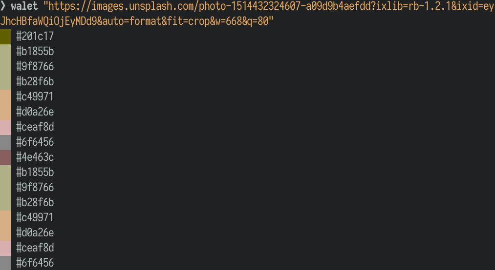

# Walet CLI

## Installation

Installation is possible using npm or yarn:

```bash
yarn global add @walet/cli

# or

npm install --global @walet/cli
```

## Usage

When installed, this package adds a global `walet` shell command.

At present, this project is in its early stages, so functionality is basic.

You can generate a colour scheme from an image using its file path, or its http(s) URL.

```bash
walet /path/to/file.jpg
walet some/relative/file.jpg
walet https://example.com/image.jpg
```

This will output a list of colours, with a preview along-side:

> 
