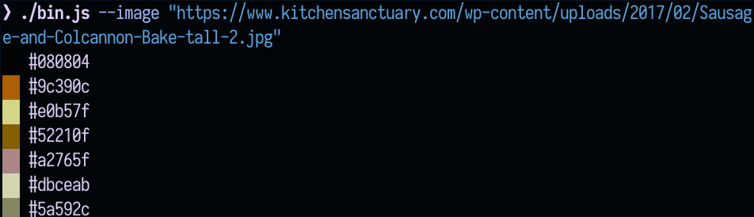

# Walet CLI

## Installation

Installation is possible using npm or yarn:

```bash
yarn global add @walet/cli

# or

npm install --global @walet/cli
```

## Usage

When installed, this package adds a global `walet` shell command.

At present, this project is in its early stages, so functionality is basic.

You can generate a colour scheme from an image using its file path, or its http(s) URL.

```bash
walet --image /path/to/file.jpg
walet --image some/relative/file.jpg
walet --image https://example.com/image.jpg
```

This will output a list of colours, with a preview along-side:

> 

### Options

#### `--image` / `-i`

The URL or path to the image.

- If a URL is passed, it must be HTTP or HTTPS, and the image must be accessible with a simple, unauthenticated GET request.
- If a file path is passed, it may be either an absolute path, or a path relative to the current working directory.

This option is required; if it is not provided, an error will be thrown.

#### `--light` / `-l`

If supplied, a light (as opposed to dark) theme will be generated. By default, this is disabled, and so a dark theme will be generated.

#### `--backend` / `-b`

Specifies the colour scheme backend to use. The current choices are:

- `vibrant` - [node-vibrant](https://npm.im/node-vibrant) _(default)_
- `wal` - A port of pywal's colour scheme generator (using ImageMagick)
